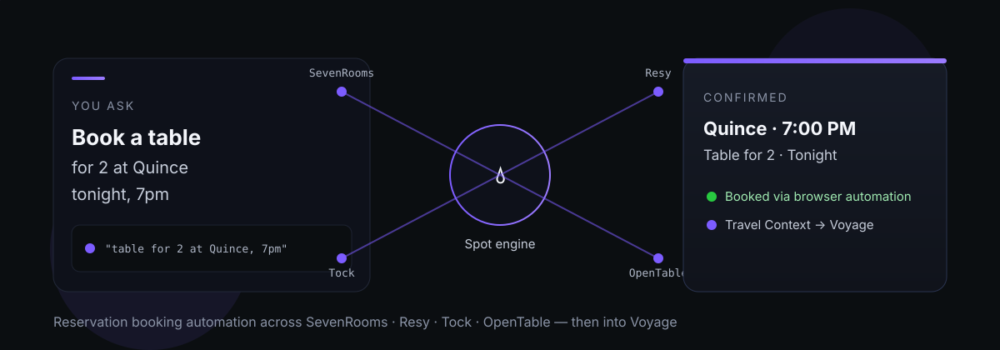
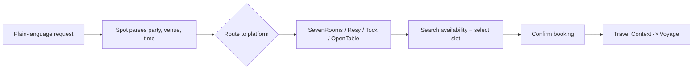

# Spot

<p align="center">
  
</p>

**Spot** turns a single plain-language request into a confirmed restaurant reservation — across **SevenRooms, Resy, Tock, and OpenTable** — through browser automation. No helper scripts, no API keys. Confirmed bookings automatically drop a **Travel Context** entry into [Voyage](https://github.com/indigokarasu/voyage).

> You say the table you want. Spot finds it, books it, and files it.

## Why not four apps?

Booking a reservation shouldn't mean opening four different clients. Spot is the one mouth for all of them:

| Platform | Handled by |
|----------|------------|
| SevenRooms | browser automation |
| Resy | browser automation |
| Tock | browser automation |
| OpenTable | browser automation |

A confirmed booking doesn't just sit in chat — it becomes a Travel Context entry in Voyage, so your trip context stays in sync without a second step.

## Quick start

Spot auto-initializes on first use. Just ask:

```
"Book a table for 2 at Quince tonight at 7pm"
"Find me a reservation at Flour + Water this week"
```

That's the whole interface — natural language in, confirmed booking out.

## How it works



The booking engine drives each platform through the browser, watches for the confirmation, and on success writes the Travel Context. Recovery and stealth-browser fallbacks keep it working when a platform's UI shifts.

## Compatibility

Skill packages follow the [agentskills.io](https://agentskills.io/specification) open standard and run on any compliant client:

- OpenClaw
- Hermes Agent
- Claude
- Any agentskills.io-compliant agent

## Dependencies

- [Voyage](https://github.com/indigokarasu/voyage) — receives Travel Context entries from confirmed bookings
- SevenRooms, Resy, Tock, OpenTable — reached via browser automation (no API keys required)

## Changelog

### v2.3.0 — April 12, 2026
- Travel Context integration with Voyage
- All platforms now handled via browser automation

---

*Spot is part of the [OCAS Agent Suite](https://github.com/indigokarasu).*
